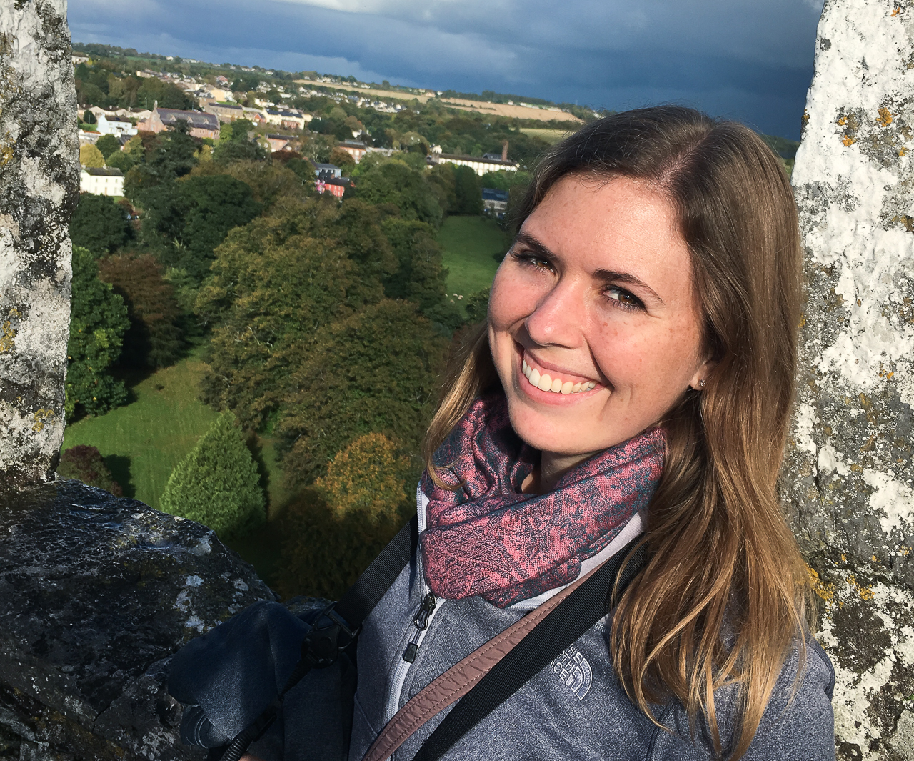
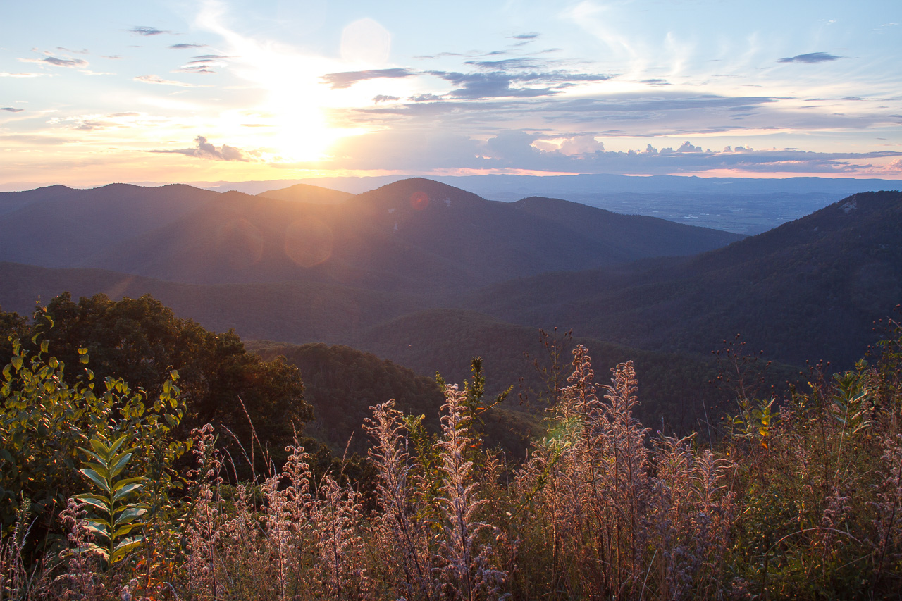
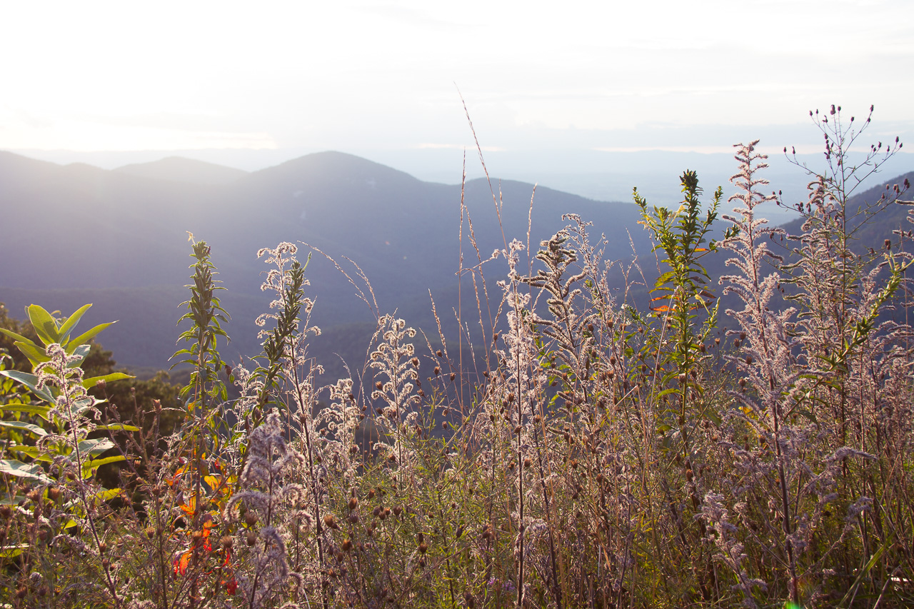

<!-- Main -->

<section id="one">
	

		<header class="major">
			<h3>Skills</h3>
		</header>
		<ul class="alt">
			<li><b>Business Intelligence:</b> Power BI</li>
			<li><b>Programming Languages:</b> Python, R</li>
			<li><b>Data Science Methods:</b> Data Cleaning, Data Visualization, Machine Learning, Predictive Analytics, Neural Networks, Text Mining, Statistics</li>
			<li><b>Environments/Software:</b> Jupyter, RStudio, PyCharm, GitHub, Microsoft Office
			<li><b>Knowledge of:</b> SQL, Tableau</li>

 
 

<section id="two" class="spotlights">
	<section>
		
		

			

				<header class="major">
					<h3>Work Experience</h3>
				</header>
				
Working for a large theme park, I have integrated, developed, and maintained a variety of PowerBI dashboards for many departments, bringing insights on financials and workload labor. By providing these dashboards, senior leaders have the power to dive in to their data and uncover insights they did not have access to before. 

			

		

	</section>
  <section>
		
		

			

				<header class="major">
					<h3>Education</h3>
				</header>
				
I earned a B.A. in Business Administration with a concentration in Entertainment & Tourism Management. Through the curiosity to learn more about data and how these insights can drive business decisions, I decided to further my education with a M.S. in Data Science. 

			

		

	</section>
	<section>
		
		

			

				<header class="major">
					<h3>Hobbies</h3>
				</header>
				
Although I am an analytical thinker, my creativity thrives through my love for photography, crafting, sewing, and quilting. I have a passion for traveling, with the goal to visit all 62 U.S. National Parks. I have visited over 50% of them, my favorite being Glacier National Park in Montana. Along with my passion for photography, the photos on my portfolio site are taken from my travels. 

			

		

	</section>
